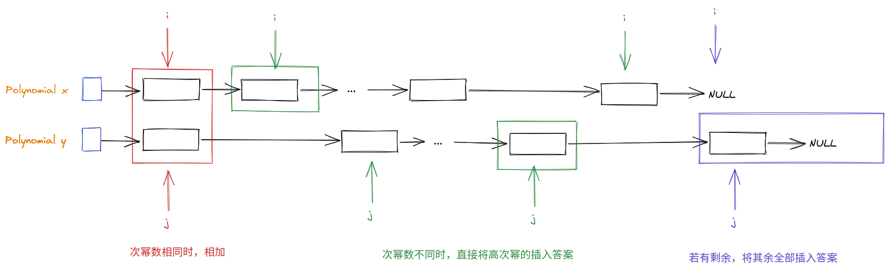
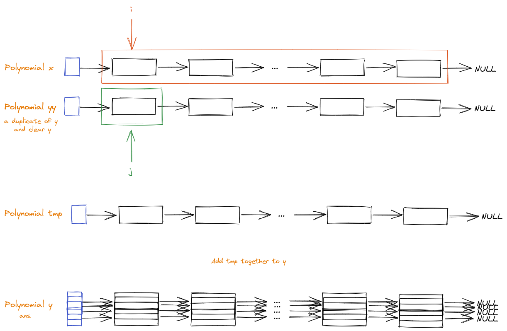
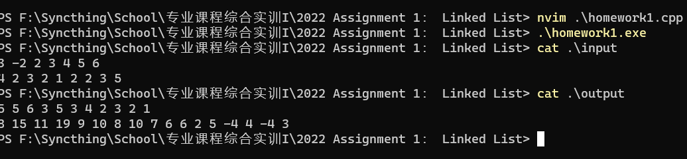

# 2022 Assignment 1： Linked List 实验报告

## 一、问题描述

(1) 如何采用链表数据结构表示一元多项式

(2) 多项式数据文件读入，形成2个链表

数据文件格式描述：

\#项数 #系数1 #指数1  #系数2 #指数2 &hellip;

3 10 5 -3 2 2 0

3 6 3 4 2 -1 1

分别表示：

$10x^5-3x^2+2$ 和 $6x^3+4x^2-x$

(3) 多项式相加，生成新的结果链表（要求根据幂级数排序）并输出到数据文件，数据文件格式同上面读入文件的格式。

(4) 多项式相乘，生成结果链表（要求根据幂级数排序）并输出到数据文件，数据文件格式同上面读入文件的格式。

## 二、设计思路

### 两层封装

- **第一层：**链表结构
- **第二层：**基于链表的多项式计算

### 加法




采用双指针同时遍历两个链表

- 当两者均没有遍历完成时，当其中一者次幂数大于另一者时直接将次幂大的项插入结果链表并移动其指针至下一节点
- 否则将二者相加后付给结果链表。

当其中一者遍历完后，原封不动将另一者剩余部分插入结果链表（如果已在结果链表中则不用插）

### 乘法

大致思路：依次用 **多项式B** 的每一项乘以整个 **多项式A**，再累加在一起。

描述：引入一个临时链表，采用双重循环，每次用其中一个多项式的一项乘以另一者整个多项式付给临时多项式链表，然后将此结果使用加法累加到结果链表中。

流程：

```
将 多项式A 乘入到 多项式B（结果保存在 多项式B 中）：
	复制一份 B 到 BB
	
	遍历 多项式BB 中的所有节点 i：
		创建临时链表 tmp
		遍历 多项式A 中的所有节点 j:
			将 i * j 插入 tmp
		将 tmp 累加到 B 中
```




## 三、测试结果 及 运行截图



## 四、程序

源代码：

- 链表封装：

  [LinkedList.h](./LinkedList.h)

  ```cpp
  #ifndef H_LINKED_LIST
  #define H_LINKED_LIST
  
  // A single node
  class Node {
      public:
          Node(); // : k(0), p(0), next(nullptr) {}
          Node(const Node& o); // : k(o.k), p(o.p), next(o.next) {}
          Node(int k, int p); // : k(k), p(p), next(nullptr) {}
  
          void insert(Node *node);
          void printNode();
          // void print();
  
          int k;
          int p;
          Node* next;
  };
  
  // The whole LinkedList
  class LinkedList {
      public:
          LinkedList(); // : headNode(Node()) {}
          LinkedList(const LinkedList& o); /*: headNode(Node()) {
              for (auto i = o.headNode.next; i; i = i->next) {
                  insert(i->k, i->p);
              }
          }*/
          void clear();
          void insert(int k, int p);
          void printList();
          // void print();
          int getSize();
  
          Node headNode;
  };
  
  #endif
  
  ```

  [LinkedList.cpp](./LinkedList.cpp)

  ```cpp
  #include <iostream>
  #include "LinkedList.h"
  
  using namespace std;
  
  // -- Node --
  // Constructors
  Node::Node() : k(0), p(0), next(nullptr) {}
  Node::Node(const Node& o) : k(o.k), p(o.p), next(o.next) {}
  Node::Node(int k, int p): k(k), p(p), next(nullptr) {}
  
  void Node::insert(Node *node) {
      node->next = next;
      next = node;
  }
  
  void Node::printNode() {
      cout << "Node<k: " << k << ", p: " << p << ">";
  }
  
  // -- LinkedList --
  // Constructors
  LinkedList::LinkedList() : headNode(Node()) {}
  LinkedList::LinkedList(const LinkedList& o) : headNode(Node()) {
      for (auto i = o.headNode.next; i; i = i->next) {
          insert(i->k, i->p);
      }
  }
  
  int LinkedList::getSize() {
      int cnt = 0;
      for (auto i = headNode.next; i; i = i->next) {
          cnt++;
      }
      return cnt;
  }
  
  void LinkedList::clear() {
      auto del = headNode.next;
      for (auto i = del->next; i; i = i->next) {
          delete del;
          del = i;
      }
      headNode.next = nullptr;
  }
  
  void LinkedList::insert(int k, int p) {
      auto pos = &headNode;
      while (pos -> next && pos -> next -> p > p) pos = pos -> next;
      pos -> insert(new Node(k, p));
  }
  
  void LinkedList::printList() {
      for (auto i = headNode.next; i; i = i -> next) {
          i->printNode();
          cout << " -> ";
      }
      cout << "null" << endl;
  }
  
  // void LinkedList::print() {
  //     cout << getSize() << " ";
  //     for (auto i = headNode.next; i; i = i -> next) {
  //         i->print();
  //     }
  //     cout << endl;
  // }
  
  ```

- 多项式封装：

  [Polynomial.h](./Polynomial.h)

  ```cpp
  #ifndef H_POLYNOMIAL
  #define H_POLYNOMIAL
  
  #include "LinkedList.h"
  
  typedef LinkedList Polynomial;
  
  void printPolynomial(Polynomial& x);
  void readPolynomial(Polynomial& x);
  void addPolynomial(const Polynomial &x, Polynomial& y);
  void mulPolynomial(const Polynomial x, Polynomial& y);
  
  #endif
  
  ```

  [Polynomial.cpp](./Polynomial.cpp)

  ```cpp
  #include <iostream>
  #include "Polynomial.h"
  
  using namespace std;
  
  void printPolynomial(Polynomial& x) {
      cout << x.getSize() << " ";
      for (auto i = x.headNode.next; i; i = i -> next) {
          cout << i->k << " " << i->p << " ";
      }
      cout << endl;
  }
  
  void readPolynomial(Polynomial& x) {
      int n;
      cin >> n;
      for (int i = 1, k, p; i <= n; i++) {
          cin >> k >> p;
          x.insert(k, p);
      }
  }
  
  // Add x to y
  void addPolynomial(const Polynomial &x, Polynomial& y) {
      auto i = x.headNode.next;
      auto j = y.headNode.next;
  
      auto prej = &y.headNode;
      while (i && j) {
          if (i->p > j->p) {
              y.insert(i->k, i->p);
              i = i->next;
          } else if (i->p < j->p) {
              prej = j;
              j = j->next;
          } else {
              j->k += i->k;
              if (j->k == 0) {
                  prej -> next = j -> next;
                  auto del = j;
                  j = j->next;
                  delete del;
              }
              i = i->next;
          }
      }
  
      while (i) {
          y.insert(i->k, i->p);
          i = i->next;
      }
  
  }
  
  // Multiply x to y
  void mulPolynomial(const Polynomial x, Polynomial& y) {
      Polynomial yy = Polynomial(y);
      y.clear();
  
      // y.printList();
      for (auto j = &yy.headNode; j->next; j = j->next) {
          auto &&target = j->next;
          auto tmp = Polynomial();
          for (auto i = x.headNode.next; i; i = i->next) {
              // i->printNode();
              tmp.insert(i->k * target->k, i->p + target->p);
          }
          // tmp.printList();
          addPolynomial(tmp, y);
      }
  
  }
  
  ```

- 测试文件：[homework1.cpp](./homework1.cpp)

  ```cpp
  #include <iostream>
  #include <cstdlib>
  #include "Polynomial.h"
  
  using namespace std;
  
  int main() {
      freopen("input", "r", stdin);
  
      Polynomial a = Polynomial(), b = Polynomial();
  
      readPolynomial(a); readPolynomial(b);
  
      // a.printList();
      // b.printList();
  
      Polynomial b1 = Polynomial(b), b2 = Polynomial(b);
  
      freopen("output", "w", stdout);
      addPolynomial(a, b1);
      printPolynomial(b1);
      // b1.print();
      // cout << "ADD: " << endl;
      // b1.printList();
  
      mulPolynomial(a, b2);
      printPolynomial(b2);
      // b2.print();
      // cout << "MUL: " << endl;
      // b2.printList();
  
      return 0;
  }
  
  ```

二进制文件：[homework1.exe](./homework1.exe)

