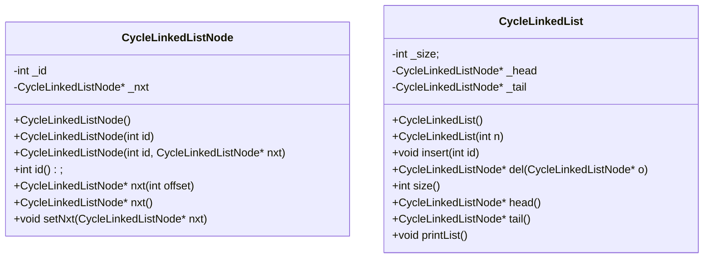
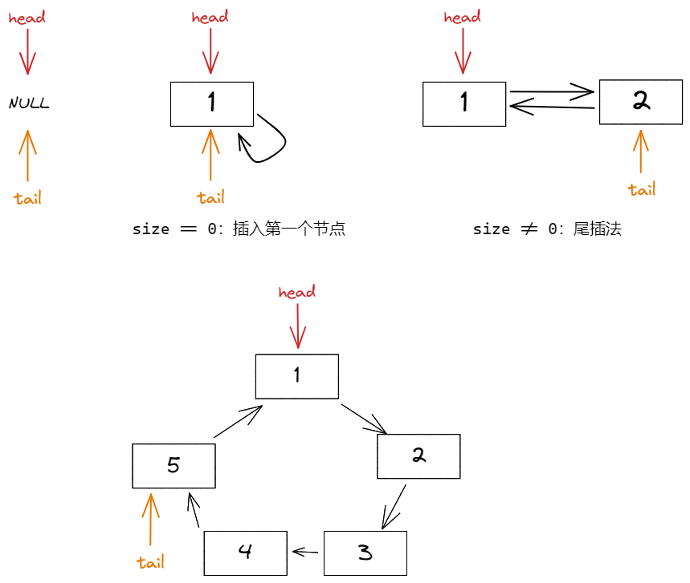
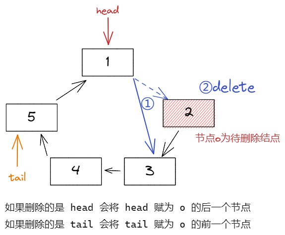
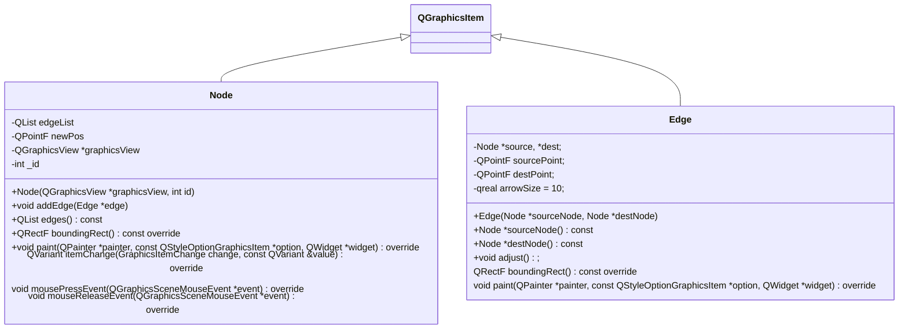
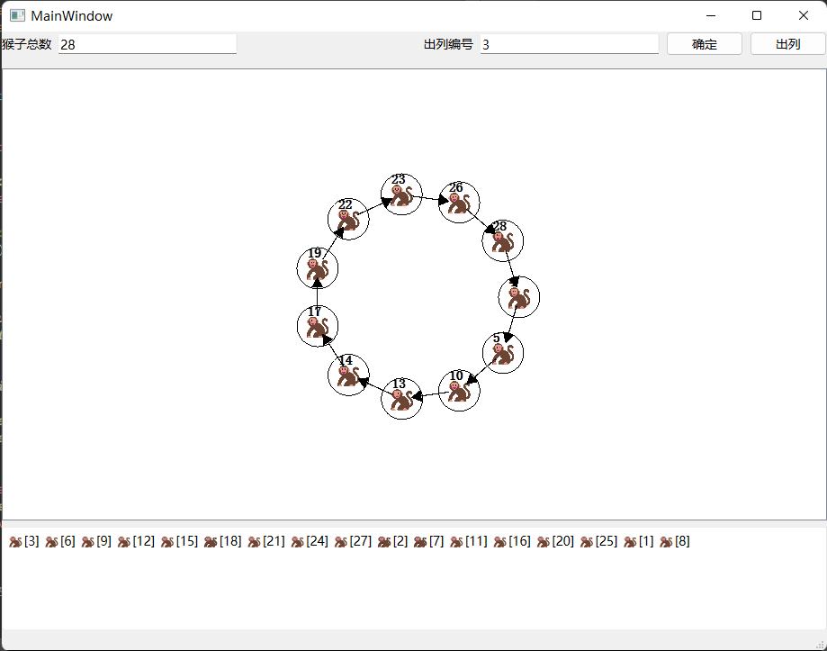
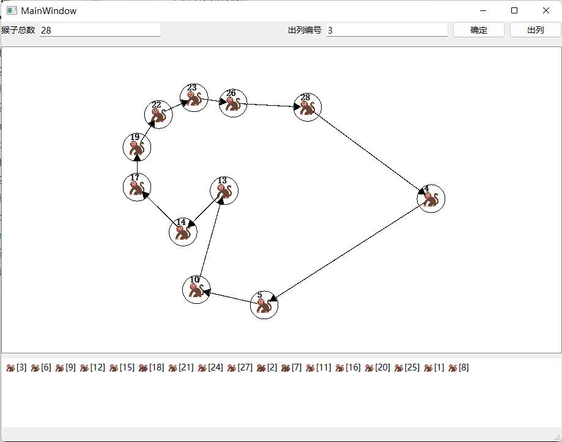
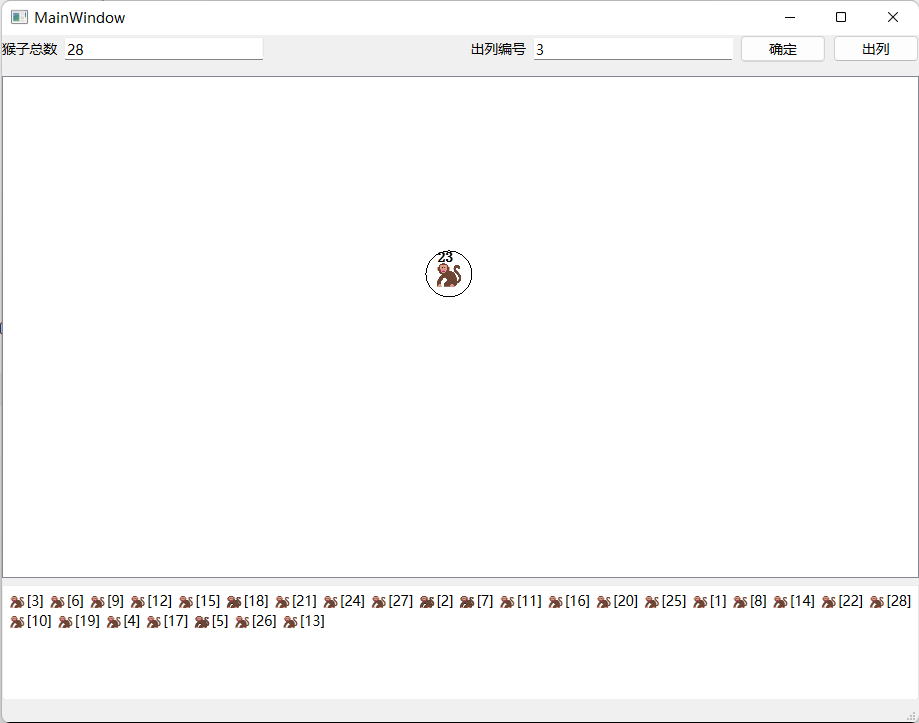

# 2022 Assignment 2：GUI 实验报告

## 一、问题描述

n只猴子，按顺时针方向围成一圈选大王（编号从1到n），从第1号开始报数，一直数到m，数到m的猴子退出圈外，剩下的猴子再接着从1开始报数。就这样，直到圈内只剩下一只猴子时，这个猴子就是猴王，编程求输入n，m后，输出最后猴王的编号。

## 二、设计思路

### 1. 循环链表封装

`CycleLinkedListNode` 和 `CycleLinkedList` 两个类分别是对链表节点和链表整体的封装。

#### UML 类图

#### 操作 | 插入

#### 操作 | 删除

### 2. GUI结构

> 采用 `QGraphicsView` 来实现对链表的可视化。

`Node` 和 `Edge` 类继承自 `QGraphicsItem`，分别完成了链表节点和边的可视化。

向 `QGraphicsView` 中 `scene` 属性添加 `QGraphicsItem`，会自动使用每个物体的 `paint()` 方法在 `QGraphicsView` 上绘制每个物体。

#### UML 类图

## 三、测试结果 及 运行截图

可以对主视图可视化链表的节点进行拖动：

最终得到猴子王：

## 四、程序文件

`mainwindow.ui`，`mainwindow.h`，`mainwindow.cpp` 主窗口

`node.h`，`node.cpp`，`edge.h`，`edge.cpp` 可绘制的节点和边

`cyclelinkedlist.h`，`cyclelinkedlist.cpp` 循环链表封装

二进制文件位于 [./MonkeyKingBinary](./MonkeyKingBinary) 目录下，已经抓去了依赖可以直接运行。