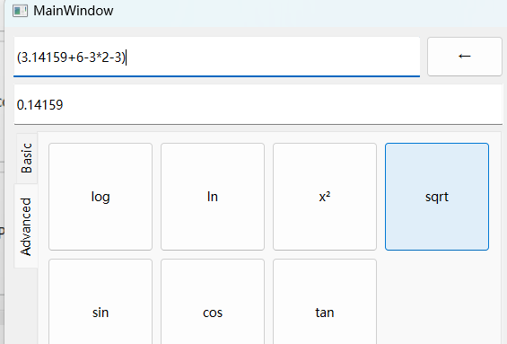

# 2022 Assignment 3：Stack 计算器（表达式求值）

## 一、问题描述

实现一个图形界面的计算器，利用栈实现中缀表达式求值，为简单起见，我们这里假设只涉及加减乘除和小括号，并且操作数都是正整数，不涉及更加复杂的数据或运算。

## 二、设计思路

### 1. 栈封装

文件：`stack.h`

使用 **模板类** 实现了通用的 `Stack` 类。

#### UML 类图


### 2. 表达式类封装

基于上述 `Stack` 类，实现了 `Expression` 类，用于进行表达式的维护、计算、操作。

#### UML 类图


表达式输入的状态枚举类 `State` 以及一元运算符枚举类 `Func`：


#### 输入状态管理

采用了 **状态机** 的思想，基于不同的状态和当前的输入来运行不同的逻辑以及进行不同状态的迁移。

状态图如下：


## 三、测试结果 及 运行截图

```
测试样例：
6*(2+3)/5+7         13
11.2+3*(5.1-0.5)    25
1.5.5.              不让输入
1++2                不让输入
1/0                 inf
)                   不让输入
*                   不让输入
()				    不让输入
1+(-2)(2+3)         不让输入
```


额外功能：


一元运算符会将前一个子表达式的结果替换为数值：




debug页面是状态以及栈的可视化：


## 四、程序文件

`mainwindow.ui`，`mainwindow.h`，`mainwindow.cpp` 主窗口

`stack.h`，`stack.cpp` 栈封装

`expression.h`，`expression.cpp` 表达式封装

二进制文件位于 [./CalculatorBinary](./CalculatorBinary) 目录下，已经抓取了依赖可以直接运行。
