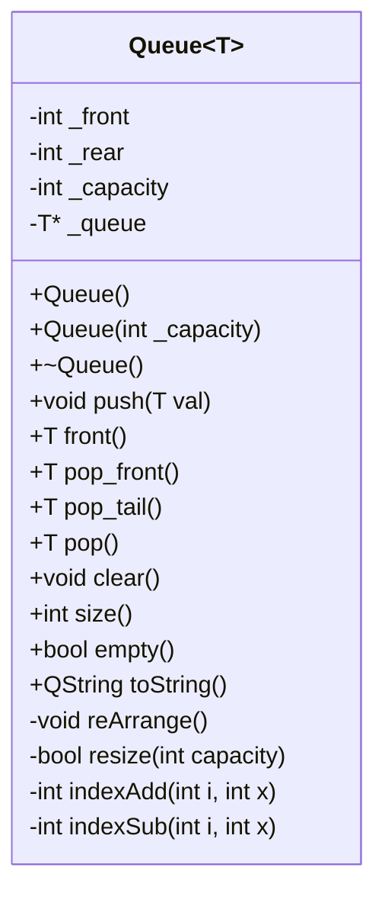
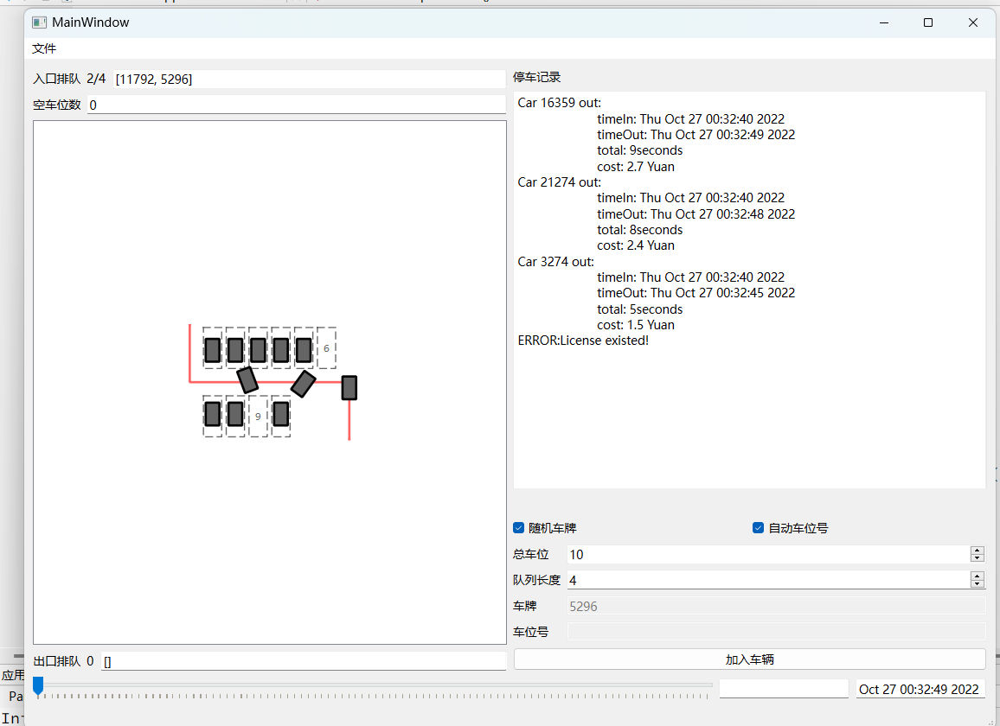
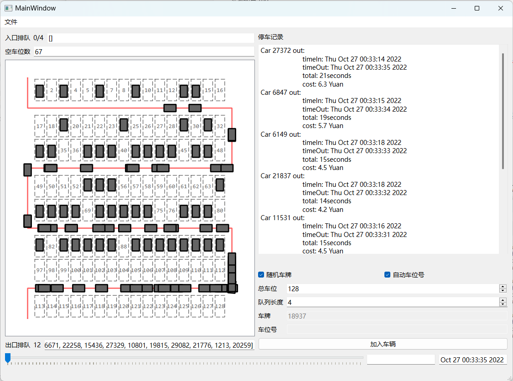

# 2022 Assignment 4：Queue 停车场管理

## 一、问题描述

某停车场可停放n辆汽车，只有一个入口和一个出口。同一时间，入口只能容纳一辆汽车进入，出口同样只能容纳一辆汽车缴费。

如果停车场内停的汽车数小于n，后来的汽车都可以在入口进入停车场内随机选择空车位停车。

如果停车场内已停满了n辆汽车，后来的汽车只能在入口外单车道的便道上排队等候，一旦有车离开出口，排在通道上的第一辆车即可从入口进入；

便道长度有限，假设排队长度不能超过固定数量m；

停车场内车辆停车时长随机模拟，例如10分钟到8小时，离开需要该辆车开出出口，排队车辆方可进入停车场。

停车场的模型可以自己设计，需要抽象成合理的数据结构。一个实际停车场模型如图1所示。


图1 实际停车场示例图

出口依据车辆停放时间分时段收费。停车收费以15分钟为1个计时单位，满1个计时单位后方可收取停车费，不足1个计时单位的不收取费用。收费标准为1.5元/15分钟，不分白天晚上。

为停车场编写按上述要求进行停车管理GUI应用模拟程序。模拟停车时间可以用1秒表示实际的1分钟或者更长时间。

## 二、设计思路

### 1. 队列封装

文件：`queue.h`，`queue.cpp`

使用 **模板类** 实现了通用的 `Queue` 类。

#### UML 类图



### 2. 图形封装

文件：

- `carpark_graphics_view.h`，`carpark_graphics_view.cpp`
- `parking_slot_graphics_item.h`，`parking_slot_graphics_item.cpp`

- `car_graphics_item.h`，`car_graphics_item.cpp`

基于 QT 的 Graphics 框架，分别实现停车位、车辆、停车场的绘制。

### 停车场车位自动规划

根据车位数量自动摆放车位并安排主道路。

```cpp
//carpark_graphics_view.cpp

/**
 * @brief Get the QPointF format position corresponding to the slot with index, 0 for entrance, n+1 for exit
 * @param index
 * @return QPointF format position
 */
QPointF GraphicsViewCarPark::getPos(int index) {
    if (index == 0)     return QPoint(0, 0);
    if (index == n + 1) return QPoint(getDir(n) > 0 ? (col + 1) * 10 : 0, getPathPos(n + 1).y() + 5 + 20);
    int &&i = getCol(index), &&j = getRow(index);
    return QPointF(i * 10, 10 + (j - 1) * 20 + (j) / 2 * 10);
}

void GraphicsViewCarPark::init(int n, int m) {
    qDebug() << "Init(" << n << ", " << m << ")";
    this->emptySlotsCnt = this->n = n;
    this->m = m;
    for (auto e: parkingSlots) {
        delete e;
    }
    parkingSlots.clear();

    col = 2 * ceil(sqrt(n * 0.5));
    row = (n + col - 1) / col;

    if (p != nullptr) delete(p);
    p = generatePath(0, n+1);

    scene()->clear();
    int cnt = 1, i = 0, j = 0;
    while (cnt <= n) {
        if (i == col) i = 0, j++;
        GraphicsItemParkingSlot* parkingSlot = new GraphicsItemParkingSlot(cnt);
        parkingSlots.push_back(parkingSlot);
        parkingSlot->setPos(getPos(cnt++));
        scene()->addItem(parkingSlot);
        i++;
    }
    scene()->update();
}
```

#### 路径规划

给定起点编号与终点编号，程序化生成中间路径。

```cpp
// carpark_graphics_view.cpp
QPainterPath *GraphicsViewCarPark::generatePath(int src, int dst) {
    QPainterPath *path = new QPainterPath();
    if (src == dst) return path;
    bool reverse = src > dst;
    if (reverse) {
        std::swap(src, dst);
    }

    int cur = src;
    if (getRow(cur) % 2 == 0 && src != 0) cur -= col;

    QPointF curPos     = getPos(cur);

    path->moveTo(curPos);
    curPos = getPathPos(cur);
    path->lineTo(curPos);

    bool ok = false;
    while (dst == n + 1 || cur != dst && (cur == 0 || cur + col != dst)) {
        int dir = getDir(cur);

        while (getCol(cur) != (dir > 0 ? col : 1) && getPathPos(cur) != getPathPos(dst)) {
            curPos.rx() += dir * 10;
            cur += dir;
        }

        if (getPathPos(cur).y() == getPathPos(n).y() && dst == n + 1 || getPathPos(cur) == getPathPos(dst)) {
            path->lineTo(getPathPos(dst));
            path->lineTo(getPos(dst));
            ok = true;
            break;
        }

        curPos.rx() += dir * 10;
        path->lineTo(curPos);
        if (row - getRow(cur) >= 2) {
            curPos.ry() += 40 + 10;
            path->lineTo(curPos);
        } else {
            path->lineTo(getPathPos(n + 1));
            path->lineTo(getPos(n + 1));
            ok = true;
            break;
        }
        curPos.rx() -= dir * 10;
        path->lineTo(curPos);
        cur += 2*col;
    }
    if (!ok) {
        path->lineTo(getPos(dst));
    }
    if (reverse) *path = path->toReversed();
    return path;
}
```

#### 车辆任务执行逻辑

停车计时器，到时间自动规划出车路径。

如果自己被设置的路径非空则会沿路径按照一定的速度一步步选取路径点并前进。

```cpp
// car_graphics_item.cpp
void GraphicsItemCar::advance(int step) {
    if (!step) return;
    if (path != nullptr) {
        double step = SPEED / path->length();
        auto p1 = pos(), p2 = path->pointAtPercent(pathProgress + step > 1 ? 1 : pathProgress + step);

        auto pDir = path->pointAtPercent(pathProgress + 20 * step > 1 ? 1 : pathProgress + step);

        QLineF line(p1, pDir);
        pathProgress += step;
//        qDebug() << "p2: " << p2;
        angle = std::atan2(-line.dy(), line.dx());
//        qDebug() << "Delta y: " << line.dy() << "Delta x: " << line.dx();
//        qDebug() << "Angle: " << angle;
        angle = normalizeAngle((M_PI - angle) + M_PI / 2);
//        if (angle >= 0 && angle < M_PI / 2) {
//            // Rotate right
//            angle += 0.2;
//        } else if (angle <= 2 * M_PI && angle > (2 * M_PI - M_PI / 2)) {
//            // Rotate left
//            angle -= 0.2;
//        }
//        qreal dx = sin(angle) * 10;
//        setRotation(rotation() + dx);

        setRotation(angle * 360 / 2 / M_PI);
        setPos(p2);
        if (pathProgress >= 1) {
            path = nullptr;
            emit movementFinished(this);
        }
    } else {
        if (!tick_stay) {
            emit removeCar(this);
        }
        tick_stay--;
//        qDebug() << tick_stay;
    }
}
```

### 3. 多线程

采用 QT 的 `QTimerEvent`，分别执行：

- `ui->graphicsViewCarPark->scene()->advance();` 更新 GraphicsView 中的每一个 GraphicsItem
- `updateTime();` 更新时间
- `updateView();` 更新视图（入口出口队列显示内容等）
- `out();` 处理出口队列（一段时间放走一辆车，模拟结算时间消耗）

## 三、测试结果 及 运行截图





## 四、程序文件

`mainwindow.ui`，`mainwindow.h`，`mainwindow.cpp` 主窗口

`queue.h`，`queue.cpp` 队列封装

`carpark_graphics_view.h`，`carpark_graphics_view.cpp`，`parking_slot_graphics_item.h`，`parking_slot_graphics_item.cpp`，`car_graphics_item.h`，`car_graphics_item.cpp` 停车场相关

二进制文件位于 [./ParkingManagerBinary](./ParkingManagerBinary) 目录下，已经抓取了依赖可以直接运行。