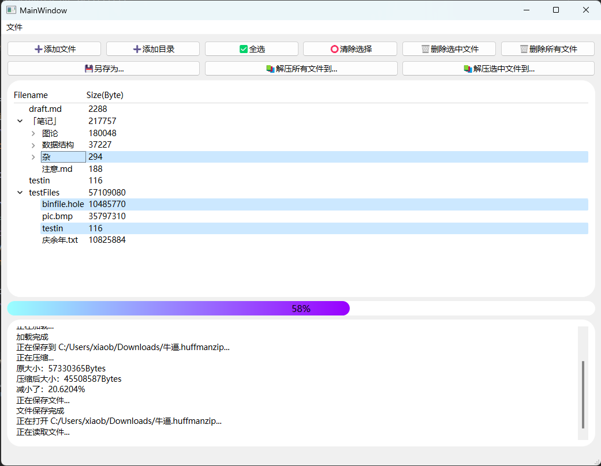
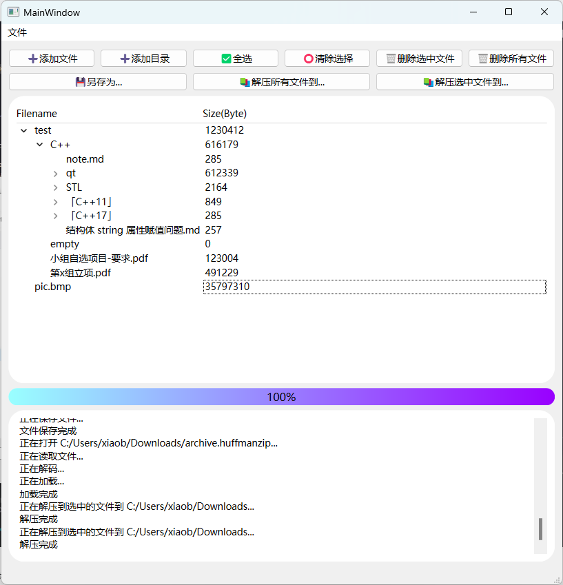

# 2022 Assignment 5: Tree 文件压缩/解压缩

## 一、问题描述

利用Huffman树和Huffman编码，完成文件的压缩和解压缩

## 二、设计思路

### 1. 哈夫曼树封装

文件：`libs/HuffmanTree.h`，`libs/HuffmanTree.cpp`

#### 类定义

```cpp
class HuffmanTreeNode {
public:
    HuffmanTreeNode() : x(0), w(0), lchild(nullptr), rchild(nullptr) {};

    HuffmanTreeNode(char x, unsigned int w);

    ~HuffmanTreeNode();

    std::vector<bool> toBits();

    static HuffmanTreeNode *fromBits(const std::vector<bool> &bits);

    static HuffmanTreeNode *fromBits(const std::vector<bool> &bits, int &index);

    friend std::ostream &operator<<(std::ostream &os, const HuffmanTreeNode &o);

    char x;
    unsigned long long w;
    HuffmanTreeNode *lchild, *rchild;
private:
//    friend QDataStream &operator>>(QDataStream &stream, HuffmanTreeNode &treeNode);
//    friend QDataStream &operator<<(QDataStream &stream, const HuffmanTreeNode &treeNode);
};

class HuffmanTree {
public:
    ////// Constructors and Destructors //////
    ~HuffmanTree();

    void init(const QMap<char, unsigned int> &byteHist);

    ////// Encoding and Decoding //////
    QMap<char, std::vector<bool>> getEncodingTable();

    ////// Printing //////
    friend std::ostream &operator<<(std::ostream &os, const HuffmanTree &t);

    ////// Serializing & Deserializing //////
    friend QDataStream &operator>>(QDataStream &stream, HuffmanTree &tree);

    friend QDataStream &operator<<(QDataStream &stream, const HuffmanTree &tree);

    HuffmanTreeNode *root = nullptr;
private:
    void getEncodingTable(HuffmanTreeNode *node, QMap<char, std::vector<bool>> &encodingTable, std::vector<bool> &code);
};
```

### 2. 压缩文件封装

文件：`libs/HuffmanCompress.h`，`libs/HuffmanCompress.cpp`

##### 类定义

```cpp
class HuffmanCompress {
public:
    enum State {
        INIT, ENCODING, COMPRESSING, DECOMPRESSING, DONE
    };

    ////// Constructors and destructors //////
    explicit HuffmanCompress(std::atomic<int> &current, std::atomic<int> &total) : current(current), total(total) {};

    explicit HuffmanCompress(const QByteArray &bytes, std::atomic<int> &current, std::atomic<int> &total);

    ~HuffmanCompress();

    ////// Serializing and Deserializing //////
    QByteArray toBytes();

    static HuffmanCompress *fromBytes(QByteArray *bytes, std::atomic<int> &current, std::atomic<int> &total);

    ////// Getters //////
    std::atomic<int> &current;
    std::atomic<int> &total;
    std::atomic<State> state = INIT;

    QByteArray getOriginalBytes();

    QByteArray getCompressedBytes();

private:
    void encode();

    void decode();

    int m_size = 0;                     // Serialized
    HuffmanTree m_huffmanTree;          // Serialized(See HuffmanTree)
    QByteArray *m_original_data_bytes = nullptr;
    QByteArray *m_compressed_data_bytes = nullptr; // Serialized
};
```

### 3. 多线程

采用 QT 的 `QTimerEvent` 以及 `std::atomic` 原子类型进行进度条的维护。

### 4. 目录树

实现了 `QAbstractItemModel` 和 `QTreeView` 的子类，以及 `FileTreeItem` 文件实体类。

文件：

- `models/FileTreeItem.h`，`models/FileTreeItem.cpp`
- `models/FileTreeItemModel.h`，`models/FileTreeItemModel.cpp`
- `views/FileTreeView.h`，`views/FileTreeView.cpp`

### 5. 工具类

文件：

- `utils/Utils.h`，`utils/Utils.cpp`
- `utils/BytesReader.h`，`utils/ByteReader.cpp`
- `utils/ByteSaver.h`，`utils/ByteSaver.cpp`

### 6. 使用 QSS 进行简单的界面美化

见截图↓

## 三、测试结果 及 运行截图





## 四、程序文件

二进制文件位于 [./HuffmanCompressorBinary](./HuffmanCompressorBinary) 目录下，已经抓取了依赖可以直接运行。