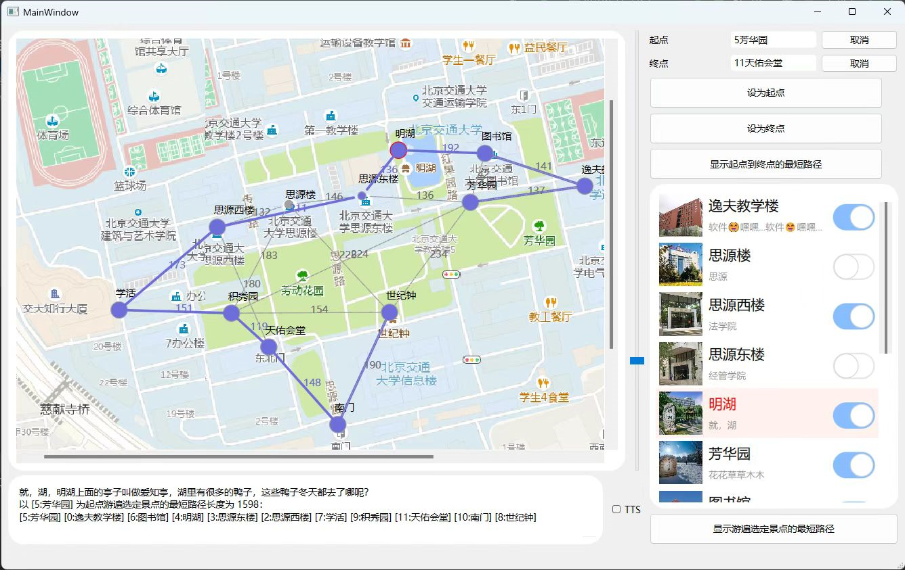

# 2022 Assignment 6: Graph BJTU游园引导

## 一、问题描述

设计开发一个"交大自助游"校园旅游咨询程序，给初次来交大参观的人员一个景点路线规划和介绍。

要求使用图来表示，实际问题转换成求最短路径问题。

## 二、设计思路

### 1. 图封装

文件：`graphics/Edge.h`, `graphics/Edge.cpp`, `InterestPointGraphicsItem.h`

### 2. 地理坐标工具类

文件：`utils/GeoUtils.h`

### 3. 数据库封装类

文件：`Database.h`

### 4. 右侧景点列表

使用 QML 实现，并利用 `QQuickWidget` 加载，通过信号槽与 C++ QWidget 交换数据。

### 5. 地图

从瓦片地图文件中提取了单层的文件，分块加载，保证分辨率。

使用 `QGraphicsView` 来动态渲染地图以及节点、边。

### 6. 最短路

样本数据较小，采用深度优先搜索（DFS）实现最短路搜索。

## 三、测试结果 及 运行截图

